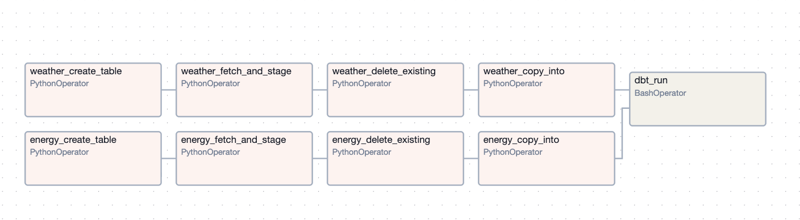
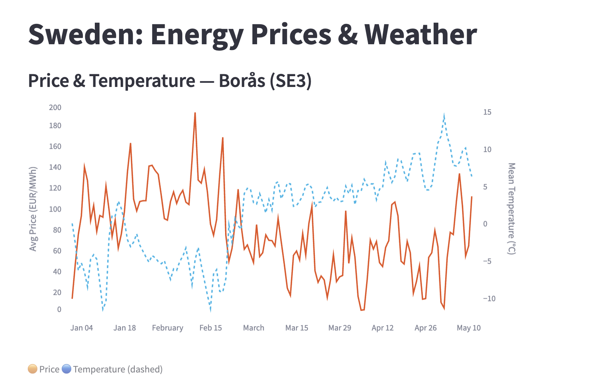
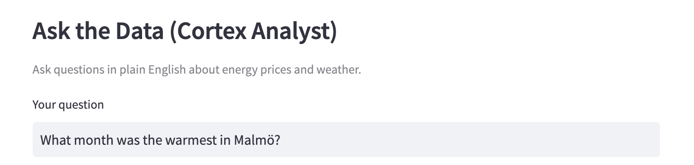

# snowflake-energy-weather

A portfolio data engineering project that ingests daily weather observations and electricity prices for Sweden, transforms them with dbt, and visualizes the relationship in a Streamlit app running inside Snowflake.

All Snowflake infrastructure — databases, schemas, roles, warehouse, and the Streamlit app itself — is provisioned and managed with Terraform.

**Data sources:**
- [Open-Meteo](https://open-meteo.com/) — daily weather for 20 Swedish cities
- [Nordpool](https://www.nordpoolgroup.com/) — day-ahead electricity prices for SE1–SE4

---

## Architecture

```
┌─────────────────────────────────────────────────────────────────┐
│                        Orchestration                            │
│                     Apache Airflow 2.9                          │
│                    (local Docker Compose)                       │
└───────────────┬─────────────────────┬───────────────────────────┘
                │                     │
        ┌───────▼──────┐     ┌────────▼─────┐
        │  Open-Meteo  │     │   Nordpool   │
        │  Weather API │     │  Prices API  │
        └───────┬──────┘     └────────┬─────┘
                │   Python ingestion  │
                └──────────┬──────────┘
                           │ PUT to internal stage
                           │ COPY INTO
                           ▼
          ┌────────────────────────────────┐
          │           Snowflake            │
          │                                │
          │  RAW_DB                        │
          │  ├── WEATHER.DAILY_WEATHER     │
          │  └── ENERGY.HOURLY_PRICES      │
          │                                │
          │         dbt Core               │
          │         (Airflow DAG)          │
          │                                │
          │  ANALYTICS_DB                  │
          │  ├── STAGING.stg_weather       │
          │  ├── STAGING.stg_energy        │
          │  └── MART.mart_weather_energy  │
          │                                │
          │  Streamlit in Snowflake        │
          │  └── ENERGY_WEATHER_APP        │
          └────────────────────────────────┘
          
          Infrastructure managed by Terraform
```

---

## Stack

| Layer | Tool |
|---|---|
| Infrastructure | Terraform (`snowflakedb/snowflake` provider) |
| Data warehouse | Snowflake |
| Orchestration | Apache Airflow 2.9 (Docker Compose) |
| Transformation | dbt Core 1.11 + dbt-snowflake |
| Ingestion | Python (requests, snowflake-connector-python) |
| Visualization | Streamlit in Snowflake |

---

## Project Structure

```
snowflake-energy-weather/
├── terraform/          # Snowflake infrastructure (roles, databases, schemas, warehouse, Streamlit app)
├── airflow/
│   ├── dags/           # pipeline.py — single DAG for ingestion + dbt
│   └── docker-compose.yaml
├── ingestion/          # Python ingestion scripts (weather + energy)
├── dbt/
│   ├── models/
│   │   ├── staging/    # stg_weather, stg_energy (views)
│   │   └── mart/       # mart_weather_energy (table)
│   └── semantic_model.yaml  # Cortex Analyst semantic layer
└── streamlit/
    └── app.py          # Streamlit in Snowflake dashboard
```

---

## Data Pipeline

The Airflow `pipeline` DAG runs daily at 07:00 UTC:

```
weather_create_table ──► weather_fetch_and_stage ──► weather_delete_existing ──► weather_copy_into ──┐
                                                                                                      ├──► dbt_run
energy_create_table  ──► energy_fetch_and_stage  ──► energy_delete_existing  ──► energy_copy_into  ──┘
```



- Weather and energy ingestion run in parallel
- Each run is idempotent — existing rows for the target date are deleted before loading
- dbt runs after both ingestion branches complete, rebuilding staging views and the mart table

---

## Snowflake Infrastructure

All resources are provisioned via Terraform with least-privilege roles:

| Role | Access |
|---|---|
| `INGESTION_ROLE` | Write to `RAW_DB` (create tables, stages, insert data) |
| `TRANSFORMER_ROLE` | Read `RAW_DB`, write `ANALYTICS_DB` (dbt) |
| `REPORTER_ROLE` | Read-only on `ANALYTICS_DB` (Streamlit) |

---

## Streamlit App

The dashboard runs natively inside Snowflake (Streamlit in Snowflake) and includes:

- **Time series chart** — daily energy price and mean temperature over time (dual axis)
- **Scatter plot** — temperature vs price across all cities in the selected bidding zone
- **Cortex Analyst** — natural language queries over the mart table via a semantic model *(requires paid Snowflake account)*





---

## Local Setup

### Prerequisites

- Snowflake account
- Terraform >= 1.0
- Docker + Docker Compose
- Python 3.9+

### 1. Infrastructure

```bash
cd terraform
cp terraform.tfvars.example terraform.tfvars  # fill in your credentials
terraform init
terraform apply
```

### 2. Airflow

```bash
# Copy and fill in credentials
cp airflow/.env.example airflow/.env

# First-time setup
cd airflow && docker compose up airflow-init

# Start
docker compose up -d

# Open http://localhost:8081  (admin / admin)
```

### 3. Run the pipeline

Trigger the `pipeline` DAG manually in the Airflow UI, or wait for the daily schedule (07:00 UTC).

### 4. Streamlit app

Upload `streamlit/app.py` and `dbt/semantic_model.yaml` to `ANALYTICS_DB.STREAMLIT.STREAMLIT_STAGE` in Snowsight, then open the app under **Projects → Streamlit**.
